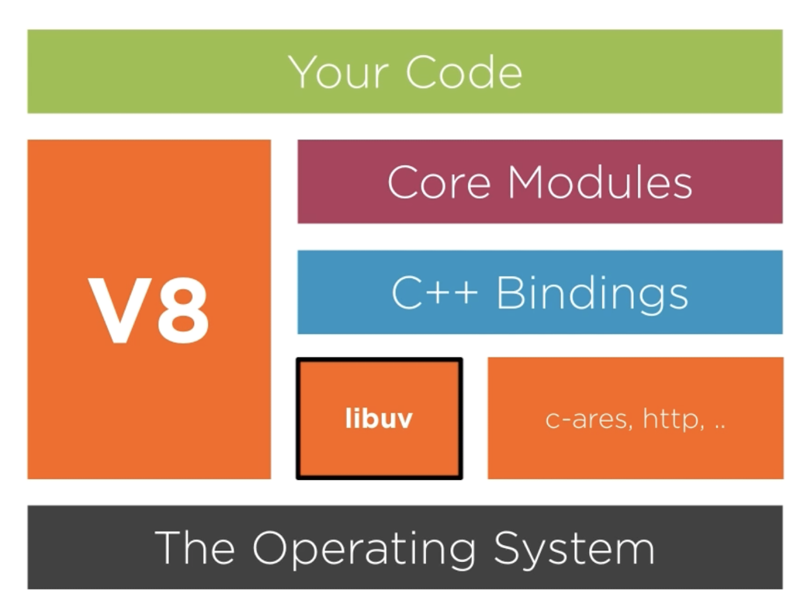

# Node Architecture V8 and libuv

- Most important players in node architecture is v8 and libuv
- Node default vm is v8 but node is vm agnostic
- Javascript features available in node are the javascript features available in v8
- JS features are managed with 3 feature groups
   
   1. Shipping 
   2. Staged
   3. In progress
   
- Staged features can be enabled by using the --harmony flag
  
  `node --harmony -p "'Node'.padEnd(8, '*')"`

- list all the in progress features

    `node --v8-options | grep "in progress"`

- node v8 options can be set manually at runtime by requiring v8 module

    `v8.setFlagsFromString()`

    `v8.getHeapStatistics()`

## Node Architecture

- Node is more than a wrapper for v8 it provides api for working with OS files, Binary data, Networking, ect.

### How V8 and Node interact and work together
1. Node uses V8 via V8's C++ API
2. Node it self has an API which we can use in JS it allows us to interact with file system, network, timers and others
3. Node API eventually executes C++ code using V8's object and function templates but it's not a part of the V8 it self
4. Node also handles waiting for asynchronous events for us using libuv
5. When node is done waiting for IO operations and timers it usually has callback functions to invoke. When it's time to invoke callback functions node passes the control back into V8 engine
6. When V8 is done with the code in the callback the control is passed back to Node
7. When control is with V8 and since v8 is single threaded Node can not execute anymore JS code No matter how many callbacks have been registered. Node will wait until v8 can handle more operations
8. This makes programming in Node easier since we don't have to worry about locking and raise conditions there is only one thread our JS will run on
9. libuv is a C library developed for Node which abstracts the non-blocking IO operations to provide a consistent interface across many operating systems. it's what handles operation on the File System, TCP, UDP sockets, child processes and others
10. libuv includes a thread pool to handle that can't be done asynchronously at the OS level
11. libuv also provides Node with the event loop
12. Other than libuv and V8 Node has few more dependencies 

    - http-parser (a small C library which parses HTTP messages)
    - c-ares (enables performing asynchronous DNS queries)
    - OpenSSL (Mostly used in TSL and Crypto modules providers implementations for many cryptographic functions)
    - zlib (used for fast async streaming, compression, decompression interfaces)